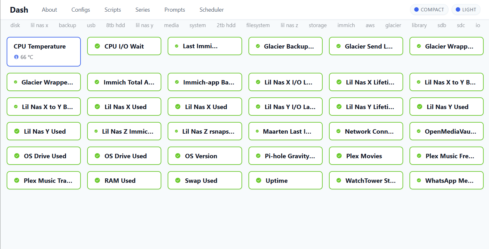
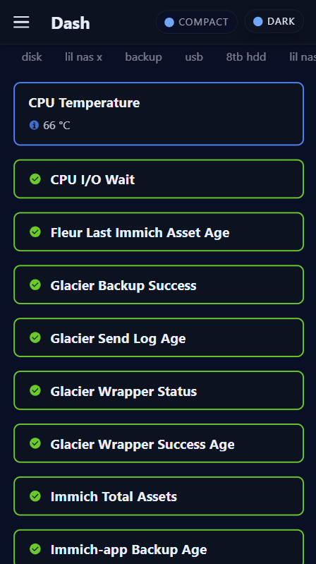
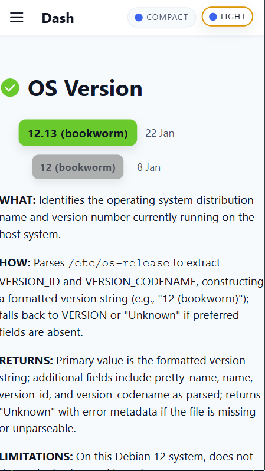
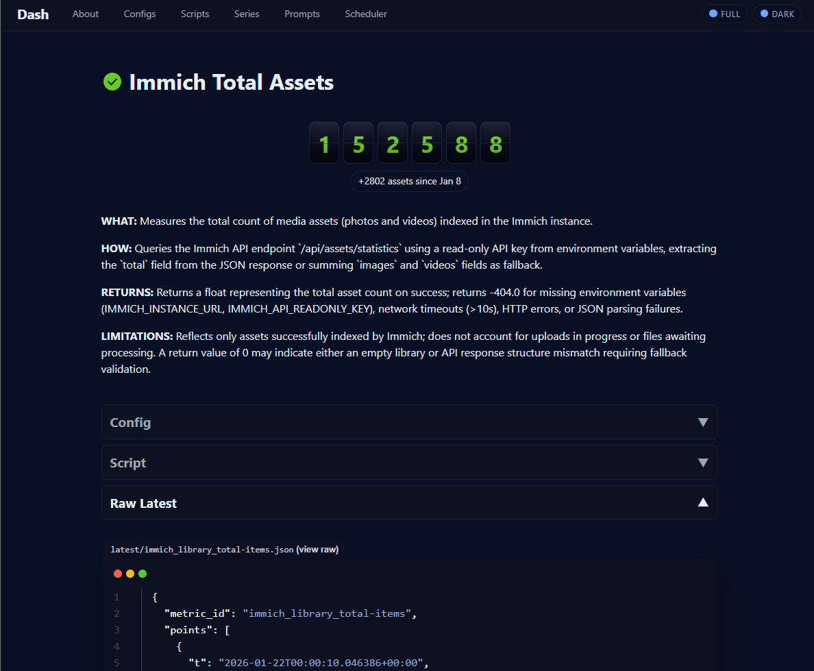
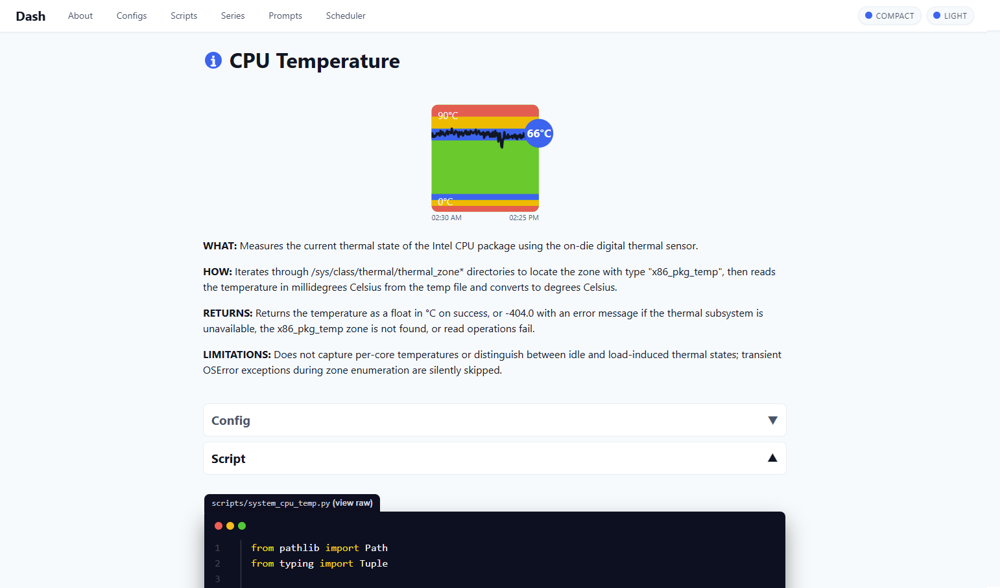
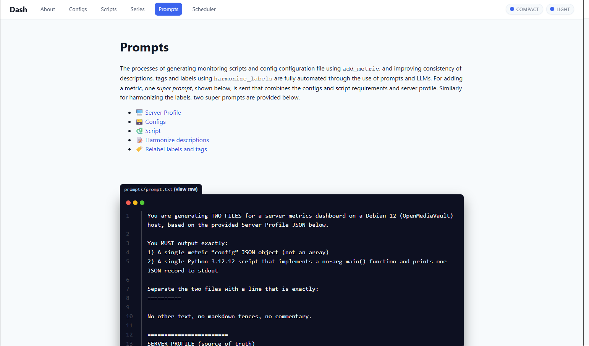
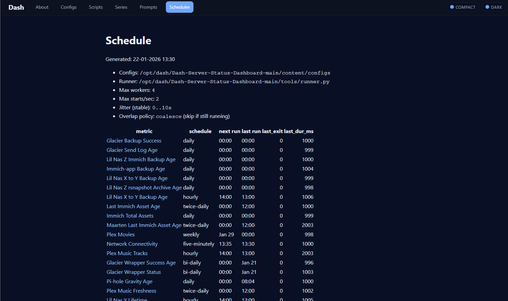

# Dash Server Status Dashboard

Dash is a lightweight, Gatsby-based server status dashboard. It provides a clean frontend for monitoring externally logged server metrics, with a strong focus on clarity, consistency, and low operational overhead.

Dash is designed to scale from a handful of checks on a single host to dozens of metrics across storage, backups, media services, and system health, without turning into an unmaintainable collection of scripts.

---

## Dashboard overview (desktop)

The homepage is a tile-based dashboard showing all monitored metrics at a glance. Each tile represents a single metric and clearly communicates its current state using status-aware styling.

Key characteristics:
- Dense but readable tile layout for desktop screens
- Immediate visibility of alert status (ok, stale, info, warning, critical)
- Status-driven edge colors make problem areas stand out instantly
- Clicking a tile navigates to a detailed metric page

This layout makes it easy to scan the system and spot issues without reading numbers.

---

## Mobile support and dark mode

Dash works well on mobile devices and supports both light and dark themes.

Highlights:
- Responsive layout adapts cleanly to smaller screens
- Compact tile rendering keeps the dashboard usable on phones
- Dark mode is fully supported and consistent across pages
- Navigation remains accessible without sacrificing information density

This makes Dash usable not just as a wallboard, but also as a quick on-the-go status check.

---

## Built-in visualizations (gauges, counters, numbers)

Dash includes several built-in visualization types that can be selected per metric, such as gauges, numeric displays, and counters.

These visuals:
- Provide immediate context (e.g. safe vs critical ranges)
- Avoid the need for custom frontend work per metric
- Are rendered consistently across the dashboard and detail pages

---

## Alternative metric displays

In addition to gauges, Dash supports other compact visual representations like counters and numeric summaries. These are useful for metrics where trends or thresholds matter more than raw time series.

Visualization choice is driven by configuration, not code.

---

## Metric configuration and scripts in the UI

Every metric has a dedicated page that shows:
- The metric configuration (JSON)
- The script used to collect the data
- The latest value and historical series

Both the configuration and the script are visible directly in the dashboard. This makes the system transparent and easy to reason about: what you see is exactly what runs.

---

## LLM-driven metric generation and validation

Dash uses LLMs (Claude by default) to generate and maintain metrics.

This includes:
- Generating metric scripts and JSON configs
- Harmonizing labels, descriptions, and tags
- Validating consistency between configs and scripts
- Reducing manual scripting to near zero

Metrics are not written by hand. Instead, prompts define intent, and generated outputs are validated before use. This keeps large metric collections consistent and easier to maintain over time.

---

## Built-in scheduler

Dash includes its own scheduler, which is part of the repository and visible in the UI.

The scheduler:
- Controls when metrics are executed
- Shows last run time, next run time, duration, and exit status
- Applies rate limits and overlap policies
- Makes execution behavior transparent and inspectable

There is no external cron setup to reverse-engineer; scheduling is explicit and documented.

---

## Current features

Already implemented:
- Tile-based homepage showing key metric information and latest values
- Dedicated pages per metric showing config, latest value, and series data
- Status-based visual cues on the homepage
- Light and dark mode
- Responsive navigation for desktop and mobile
- Built-in scheduler with UI visibility
- LLM-assisted metric generation and validation

## Future directions

Changes for later versions:
- Editing config files directly from the UI
- Creating new configs from the frontend
- Dedicated pages for integrations, with editing support

---

Dash aims to stay small, explicit, and understandable, while still supporting complex monitoring setups without turning into a maintenance burden.
